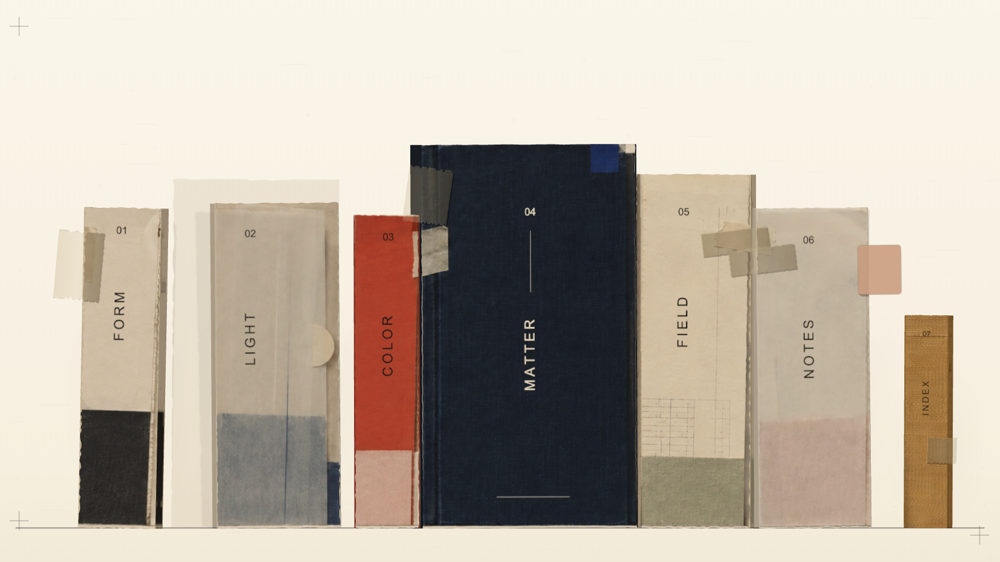

# Ice-material-library-studio

**把网页做成一格可以打开的书架。**

这是一个与 AI 一起制作的交互实验：一屏书架，七本各有质感的小书。纸张的毛边、布面的纹理、半透明的描图纸和旧胶带，共同组成一个可以靠近、抽出、翻开的数字空间。

它不是一张静态背景图。每本书都有独立的三维结构、封面和内页，可以作为个人网站、作品集或创作档案的目录形式。目前这个仓库提供的是独立的 **Studio 演示版**，书内文字均为虚构的材质研究笔记。



## 交互方式

- **悬停**：书本轻轻抬起，产生位移与转动。
- **点击**：将书从架上抽出，转向正面封面。
- **再次点击选中的书**：打开或合上封面。
- **点击空白处 / 按 Esc**：把书放回原位。
- **键盘操作**：使用 Tab 选中书本，按 Enter 操作。

七本书分别是 `FORM`、`LIGHT`、`COLOR`、`MATTER`、`FIELD`、`NOTES` 和 `INDEX`，最右侧的小黄书也可以打开。

## 本地运行

需要 **Node.js 22.13 或更新版本**。

```sh
git clone https://github.com/MegD1/Ice-material-library-studio.git
cd Ice-material-library-studio
npm ci
npm run dev
```

打开终端输出的本地地址即可。`/` 和 `/studio` 都会显示同一个独立书架，无需配置后端、数据库、账号或 API Key。

## 技术与材质

| 部分 | 实现方式 |
| --- | --- |
| 页面 | React + TypeScript + Vite |
| 三维场景 | 原生 Three.js，正交视角与独立书本模型 |
| 动效 | GSAP 驱动抽出、旋转、翻开与归位 |
| 装订结构 | 封面绕装订边旋转，书页块与封面分别建模 |
| 材质 | 生成的材质图集 + Canvas 程序化纸纹、布纹与胶带 |
| 兼容处理 | 减弱动态效果偏好支持，以及无 WebGL 时的 2D 回退 |

材质图集随仓库提供，位于 `public/textures/book-spines.webp`。运行时不依赖外部图片服务。

## 修改内容

| 文件 | 用途 |
| --- | --- |
| `src/content.ts` | 书脊名称、封面标题和内页短文 |
| `src/BookshelfScene.tsx` | 书架构图、材质、灯光和交互 |
| `src/BookBinding.ts` | 封面铰链与书页块几何结构 |
| `src/styles.css` | 全屏舞台与基础样式 |

## 构建与检查

```sh
npm run check
npm run build
npx playwright install chromium
npm test
npm run preview
```

`check` 包含 TypeScript 检查和独立版本的文件边界检查。浏览器测试覆盖七本书的打开与关闭、键盘操作、两种桌面尺寸、Canvas 加载和 WebGL 回退。

也可以使用本机已安装的 Chrome 运行测试：

```sh
PLAYWRIGHT_CHANNEL=chrome npm test
```

## 当前范围

- 仅面向桌面端，画面最小宽度为 `1180px`，暂未适配手机。
- 这是书架交互与材质实验，不包含完整的作品集详情页或内容管理系统。
- 仓库仅包含匿名 Studio 版本，不包含个人简历、工作资料、原站页面或原站 Git 历史。
- 尚未配置线上部署。仓库公开后可以查看和下载代码，但不会自动生成可访问的网站。
